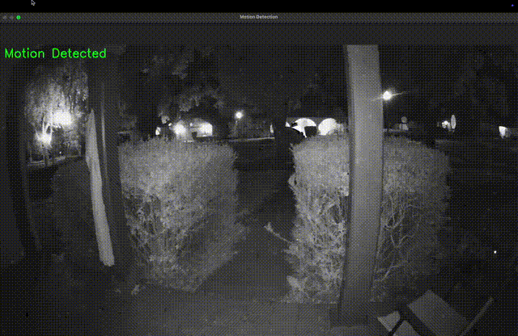

# Motion Detection using OpenCV


### :pushpin: Overview
##### This project implements a simple motion detection system using OpenCV. It compares consecutive video frames to detect movement and highlights moving objects in real-time.
#


### 🎥 Demo

#


### 🛠 Features
##### ✅ Motion detection based on frame differencing
##### ✅ Adjustable sensitivity and threshold parameters
##### ✅ Works with webcam or pre-recorded videos
##### ✅ Real-time object highlighting
#


### 🏗 Installation
##### 1️⃣ Clone the repository
```bash
git clone https://github.com/your-username/motion-detection.git
cd motion-detection
```
##### 2️⃣ Install dependencies
##### Make sure you have Python installed, then run:
```bash
pip install -r requirements.txt
```
##### 3️⃣ Run the program
##### To use a video file:
```bash
python main.py --video path/to/video.mp4
```
##### To use a webcam:
```bash
python main.py --webcam
```
#

### ⚙ Configuration
##### You can modify detection sensitivity by adjusting parameters in motion_detection.py:
```bash
motion_detector = MotionDetection(motion_hold=5, motion_threshold=100)
```
##### •	motion_hold: Number of frames to hold before checking for motion
#####	•	motion_threshold: Minimum contour area to consider motion
#

### 📂 Project Structure
```bash
motion-detection/
│── motion_detection.py   # Motion detection logic
│── main.py               # Runs the detection
│── requirements.txt      # Dependencies
│── README.md             # Project documentation
```
#

### 🖥 Dependencies
#####	•	Python 3.x
#####	•	OpenCV (cv2)
#####	•	NumPy
#

### 📜 License
##### This project is licensed under the MIT License.


